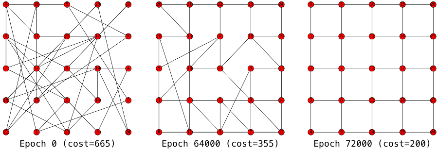

# Metaheuristic for Component placement optimization

*Note*: This is not something meant for production, only an exercise for me. Don't bother
opening issues or sending pull requests, I won't be maintaining this.

Optimizing the placement of electronic components on a circuit board is a NP-hard problem.

Finding the perfect solution with an algorithm is typically not possible in reasonable time, which is why using an heuristic is a good idea if you can settle with a not-quite-perfect-but-still-good solution.

Metaheuristics, are, in this fashion, heuristics design to find such an heuristic for a given optimization problem.

This projects uses two metaheuristics to optimize the placement of electonic components in a given graph.

* `annealing/` uses Simulated Annealing to find a configuration with minimum cost.
* `genetics/` uses a genetic algorithm to find a configuration with minimum cost.

## Prerequisites

You'll need Python 3, and the `networkx` and `matplotlib` modules.

## Usage

Run `./<impl>/run.py`, where `<impl>` is either `annealing` or `genetics`.

The script optionally takes an integer seed as parameter to replay a particular scenario.

The script will create image files and display a visual representation of its state for each update.

You can further tune the parameters in `./<impl>/config.py`.
